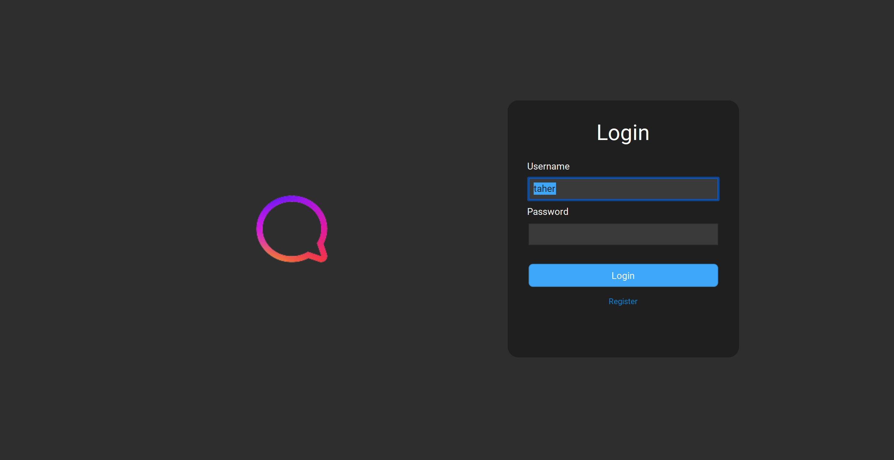
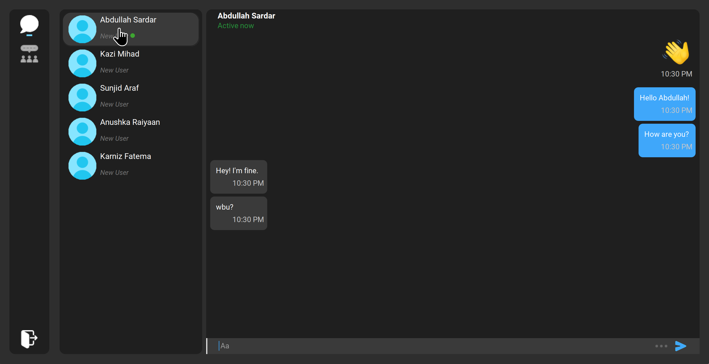
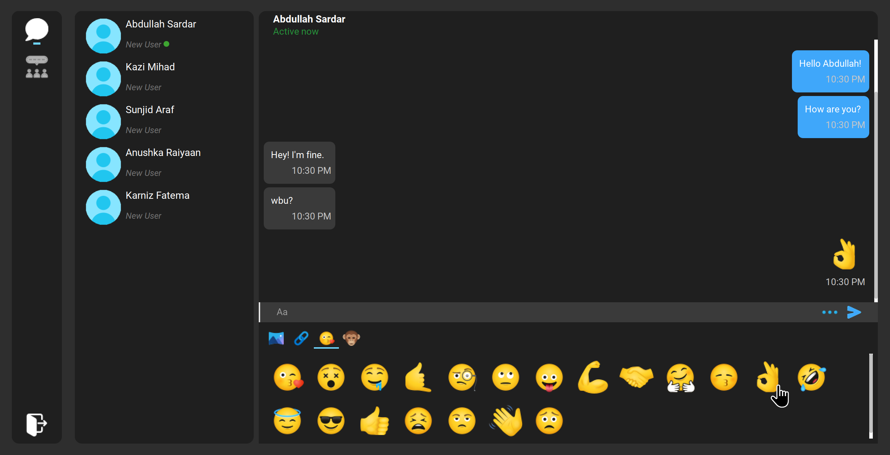

# <div align="center"></div>

# Java Chat Application (Swing Client + Socket.IO Server + MySQL)

This repository contains a **desktop chat application** built with **Java Swing** and a **Socket.IO** server (Netty). Users can register/login, see online users, and send messages in real time.

> Build system: **Apache Ant / NetBeans projects** (two modules: client + server).

---

## Table of Contents

- [Overview](#overview)
- [Features](#features)
- [Tech Stack](#tech-stack)
- [Prerequisites](#prerequisites)
- [Database Setup (MySQL)](#database-setup-mysql)
- [Build & Run (Ant)](#build--run-ant)
- [Troubleshooting](#troubleshooting)
- [Project Structure](#project-structure)
- [Screenshots](#screenshots)

## Overview

- **Client**: `Chat_Application/` (Swing UI)
- **Server**: `server/` (Socket.IO server + MySQL access)
- **Default port**: `9999`

## Features

- Register / Login
- Online user list + status updates
- Real-time chat (text + emoji; also supports file/image sending)
- **Chat history**: text/emoji messages are persisted in MySQL and loaded automatically when you open a conversation

## Tech Stack

- Java 8 source/target (works with newer JDKs too)
- Swing UI + NetBeans `.form`
- Socket.IO:
  - Server: `netty-socketio`
  - Client: `socket.io-client` (Java)
- MySQL database

## Prerequisites

- Java JDK installed (Java 8+ recommended; project compiles on newer JDKs as well)
- Apache Ant installed (`ant -version`)
- MySQL Server running locally

## Database Setup (MySQL)

The schema file is:

- `Chat_Application/db/chat_application.sql`

It creates the database (if needed) and tables.

### 1) Start MySQL

Make sure MySQL is running and you can connect:

```bash
mysql -uroot
```

### 2) Import schema

From the repository root:

```bash
mysql -uroot < Chat_Application/db/chat_application.sql
```

### 3) Verify tables

```bash
mysql -uroot -e "USE chat_application; SHOW TABLES;"
```

## Build & Run (Ant)

Run these commands from the repository root.

### 1) Build server + client

```bash
ant -f server/build.xml clean jar
ant -f Chat_Application/build.xml clean jar
```

### 2) Start the server

```bash
ant -f server/build.xml run
```

The server listens on port `9999`.

### 3) Start the client

In a new terminal:

```bash
ant -f Chat_Application/build.xml run
```

You can run multiple client instances to test chatting between users.

## Troubleshooting

### Port 9999 already in use

```bash
lsof -nP -iTCP:9999 -sTCP:LISTEN
```

### MySQL connection issues

The server config is in `server/src/connection/DatabaseConnection.java`.

- Database: `chat_application`
- Host/port: `localhost:3306`
- User: `root`
- Password: (empty by default)

If your MySQL root password is not empty, update it there.

### History not loading

History is loaded via a Socket.IO event named `load_history` and currently persists **TEXT/EMOJI** messages only.

## Project Structure

```
.
├── Chat_Application/          # Swing client
│   ├── db/                    # MySQL schema
│   ├── lib/                   # client libraries
│   └── src/
│       ├── form/              # screens (Login, Home, Chat, ...)
│       ├── component/         # chat UI components
│       ├── model/             # client models + JSON helpers
│       └── service/           # Socket.IO client wrapper
├── server/                    # Socket.IO server
│   ├── lib/                   # server libraries (including MySQL Connector/J)
│   └── src/
│       ├── connection/        # DB connection
│       ├── service/           # socket handlers + DB services
│       └── model/             # server-side models
└── preview-images/            # screenshots
```

## Screenshots

### Server Console


### Client Login



### Chat Interface

| Chat View 1 | Chat View 2 |
| --- | --- |
|  |  |

---

**Note:** This project is for educational purposes.
